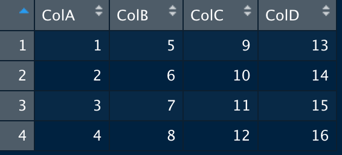

Hi All,

This repository contains your your exam 1. It is strongly recommended that you continually commit your changes as you continue to work on your exam.


This exam has been written in Markdown and its formatting can be conveniently visualized from the GitHub repository browser page. Although it is suggested that you work using the GitHub browser to make use the markdown formatting and to commit your changes, you can still clone the repository to your local machine to work on it there. The commands to commit your work are the following.

```
git add -A
git commit -m "My submit message"
git push
```

Please make sure that your answers are submitted in a proper Markdown format. Points will be deducted for not using appropriate Markdown format.


Please work individually. By submitting your work, you confirm that you have abided by the Allegheny College Student honor code.


Best of luck to you,

Dr. BONHAM-CARTER


---

### Name
Add Your Name Here


---


### Problem 1
(5 Points)

Short Answer:
In the associated figure of the flights data set, the x-axis has been assigned to "air_time" and the y-axis has been assigned to "distance." There are many qualities of the plot that indicate non-random behavior in the data.

In clear and meaningful language, choose two (2) non-random trends in the plot that you notice. For each trend, discuss why you are sure that the trends in the data exists and that it is not a random occurrence in the data.


Plot for Problem 1


**Place your discussion below**

`TODO`


---

### Problem 2
(7 Points)


Short answer: In the associated plot, there are data points which are accompanied by a bold, smooth line.

A) What benefits are offered by adding this smooth line to a plot? In clear and
meaningful language, explain two (2) pieces of relevant information that we can
extract from this smooth line.

B) Explain one (1) disadvantage that occurs when observing only the smooth
line, in absence of the data points.


Plot for Problem 2


**Place your discussion below**

First trend discussion:
`TODO`


Second trend discussion:

`TODO`


---
### Problem 3
(13 Points)


Matching. Match each vocabulary element to its the corresponding definition.
__(Note, if you are able to view markdown formatting in your document, the below table contains the vocabulary and the definitions to be matched.)__

| Term	|	Definitions|
| ---- | ---- |
|1.	arrange()		|A.	A method to display formatted data frames.|
|2.	Camelcasing	|	B.	A scatter point creator function.|
|3.	filter()		|	C.	Able to generate new variables from existing variables in a dataset. This function is also able to preserve the existing variables from the dataset.|
|4.	geom_point()	|	D.	Collapse data into single subsets.|
|5.	ggplot()	|	E.	Command to get the column headers of a table.|
|6.	mutate()	|	F.	Concatenate vectors after converting them to character forms.|
|7.	names()	|	G.	Finds rows/cases where conditions are true.|
|8.	paste()	|	H.	Generates regular sequences.|
|9.	rm(list = ls())	|	I.	Picks columns.|
|10.	select()	|	J.	Removes existing variables in memory.|
|11.	Seq()	|	K.	Reorders rows in a table according to conditions.|
|12.	summarise()	|	L.	This function declares an input data set for a graphic and specifies aesthetics.|
|13.	view	|	M.	Writing variables in the form; "myDataNum."|


**Pair the definitions (letters) on the numbered lines (terms)**

`TODO`


---


### Problem 4
(5 Points)

Multiple choice: For a blogging website, which of the following statements would most strongly suggest a poorly performing landing page (i.e., a high amount of traffic that quickly leaves a site)?

 - A. Percentage of New Visits is greater than 90%
 - B. A low bounce rate
 - C. Session Duration is greater than 5 minutes
 - D. A high bounce rate


 **Place your answer here:**

`TODO`


 ---

### Problem 5
(5 Points)

 Multiple choice: In order to get users to sign-up for their newsletter, the company runs a holiday email campaign for the month of December to drive newsletter signups. Which of the following metrics would be the best indicator of this campaign’s success?
 - A. Session duration
 - B. Conversion rate
 - C. Bounce rate
 - D. Average time on page

**Place your answer here:**

`TODO`


---

### Problem 6
(5 Points)


Matching. Complete the matching for Google Analytics terms to their definitions.
**(Note, if you are able to view markdown formatting in your document, the below table contains the vocabulary and the definitions to be matched.)**

| Term		|	Definitions|
|:----|:----|
| 1. Organic Searches| A. Visitors who come to your website without a traceable referral source, such as typing your URL into their address bar or using a bookmark on their browser.|
|2. Paid Searches| B. Visitors who come to your website from an AdWords or other paid search ad. |
|3. Direct Searches| C. Visitors who come to your website from another website by clicking on a link.|
|4. Referral arrivals| D. Visitors who come to your website from a social network.|
|5. Social arrivals| E. Visitors who come to your website after searching Google.com and other search engines |

**Pair the definitions (letters) on the numbered lines (terms)**

`TODO`


---
### Problem 7
(10 Points)


Multiple choice: A data frame called, "myTable" has been created  and is shown below. Using the data in the figure, what is the result of the following summation command?

```
sum(myTable[1,3],myTable[3,1])
```


Table for Problem 7


 - A. 18
 - B. 24
 - C. 12
 - D. 17


**Place your answer here:**

`TODO`


---

### Problem 8
(10 Points)


Multiple choice: When plotting data sets in class using the `ggplot()` function, our code included a reference to the function, `aes()`.

What does the `aes()` function do in the plotting function?
 - A. This function specified which rows to include in the plot.
 - B. This function created the canvas for the plot.
 - C. This function selected columns to include in the plot.
 - D. This function determines how to place and decorate points on the canvas.


 **Place your answer here:**

`TODO`


---

### Problem 9
(10 Points)


Short answer: In the associated plot of a data set, the _x_-axis has been assigned to "density", and the _y_-axis has been assigned to "conc." Which type of mapping function would you expect to find in the `ggplot()` code block to create this plot? In clear and meaningful language,  offer a justification of your response.


Plot for Problem 8

**Place your discussion below**

`TODO`


---

### Problem 10
(10 Points)

Multiple choice: Use rStudio to make a scatter plot of the "flights" data set, as we have done in class. In your code to create the plot, set the _x_-axis to "carrier" and the _y_-axis to "distance" of the flights dataset.

When you run your code, a plot is created in which two apparent outliers that can be found around the _y_ = 5000 magnitude line.

With which two carriers are these points associated?

 - A. "HA" and "UA"
 - B. "B6" and "DL"
 - C. "AA" anbd "MQ"
 - D. "MQ" and "9E"


 **Place your answer here:**

`TODO`


---

### Problem 11
(10 Points)

Multiple choice: Use rStudio to make a plot of the "diamonds" data set as we have done in class. Assign the _x_-axis to "carat" and the _y_-axis to "cut." In addition, assign _color_ to "clarity" and _size_ to "price."

Your completed plot should have the cut quantities, "Ideal", "Premium", "Very Good", "Good" and "Fair" running along from the _y_-axis where the data points of these groups are clearly visible.

An "outlier" is defined in this dataset as a point that is removed from the rest of its group and does not touch any other point in its category.

Which group has such an outlier which stands almost one full carat unit away from the the rest of the points of the plot?


- A. "Very Good"
- B. "Ideal"
- C. "Good"
- D. "Fair"


 **Place your answer here:**

`TODO`


---

### Problem 12
(10 Points)

Multiple choice: Use rStudio to make a plot of the "diamonds" data set as we have done in class. Assign the _x_-axis to "carat" and the _y_-axis to "cut." In addition, assign _color_ to "clarity" and _size_ to "price."

Analyzing the colors of the data points for the "Ideal" category, which quantities of clarity are (generally) found on the right side of the spectrum?


 - A. The quantities, "VS2", "IF" and "VVS1" are on the right.
 - B. The quantities, "I1", "SI2", and "SI1" are on the right.
 - C. The quantities, "IF', "VVS1" and "VVS2" are on the right.
 - D. The quantities, "VS2", VS1" and "VVS2" are on the right.


 **Place your answer here:**

`TODO`


---

### Bonus Question:
(Earn back 10 points)

Short answer: In clear and meaningful language, explain how an unjust or unethical policy could result from the improper use of data analytics.


**Place your discussion below**

`TODO`


---
(Did you remember to add your name above?)
